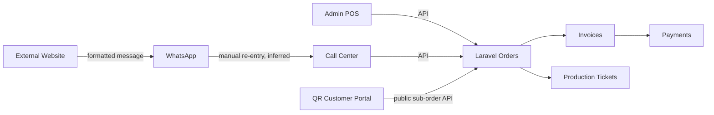
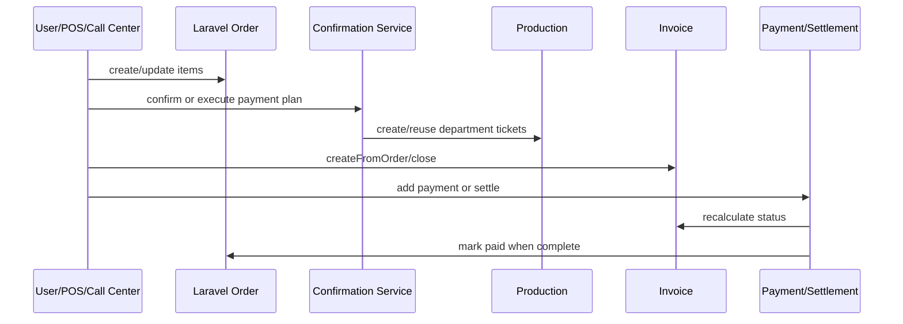
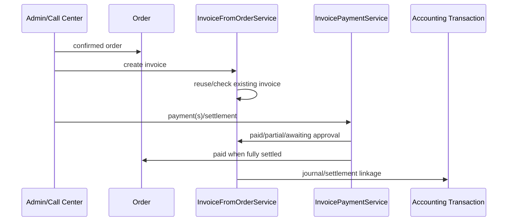
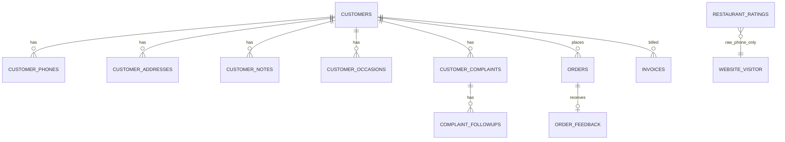

# CURRENT STATE AUDIT — Phase C

> تاريخ الجرد: 2026-08-04. هذا تقرير حالة راهنة فقط، وليس تصميمًا مستهدفًا. لم تُشغّل migrations أو seeders ولم تُعدّل بيانات أو ملفات تطبيقية. التصنيفات المستخدمة: **Verified** (مثبت بالكود)، **Inferred** (استنتاج معلّل)، **Missing** (غير موجود في الكود المفحوص)، **Conflicting** (تعريفات متعارضة)، **Blocked** (تعذر التحقق).

## 1. Executive Summary

الأنظمة المفحوصة هي: Laravel 12 المحلي بوصفه نظام التشغيل والماليات الفعلي، واجهة React/Vite للإدارة وPOS والكول سنتر، وموقع Next.js خارجي بقاعدة PostgreSQL مستقلة للتقييمات فقط.

الجاهزية العامة للربط **Partial وغير آمنة للربط المالي المباشر قبل حسم القرارات المعمارية**. Laravel يحتوي بالفعل على عميل وطلب وفاتورة ودفعة وتذاكر إنتاج وCRM وصلاحيات وidempotency جزئي لتدفق الكول سنتر. لكن الموقع لا ينشئ طلبات في Laravel؛ checkout الحالي ينشئ نص WhatsApp فقط، كما أن الأسعار والفروع ورسوم التوصيل مكررة وثابتة داخله.

أهم خمسة اكتشافات:

1. **Verified:** Laravel هو النظام الوحيد الذي يملك سلسلة Order → Invoice → Payment → accounting transaction قابلة للتنفيذ.
2. **Verified:** توجد هوية عميل غنية في Laravel، مع `customer_phones` وعناوين وملاحظات ومناسبات وشكاوى، لكن لا UUID أو portal account.
3. **Verified:** واجهة الإدارة تملك CRM حقيقيًا متصلًا بمسارات `/api/crm/*`، إضافة إلى CRM آخر داخل الكول سنتر؛ توجد ازدواجية واجهات مفاهيمية.
4. **Verified:** الموقع الخارجي يرسل السلة إلى `wa.me` ولا يحفظ Order أو Payment أو Customer؛ PostgreSQL فيه يحفظ `restaurant_ratings` فقط.
5. **Conflicting:** حالات الطلب ليست قاموسًا واحدًا؛ تظهر `pending`, `pending_confirmation`, `pending_payment`, `confirmed`, `in_progress`, `ready`, `served`, `paid`, `cancelled`، بينما الإنتاج يستخدم `pending/preparing/ready/served/cancelled`.

أهم خمسة مخاطر: إنشاء مالي مكرر دون مفتاح موقع ثابت، اختلاف الأسعار، ازدواج العملاء بسبب الهاتف غير الموحّد تاريخيًا، تعارض الحالات، وعدم وجود Outbox/Inbox أو معالجة انقطاع الإنترنت. يمكن بدء مرحلتي D وE للاستكشاف واتخاذ القرار، لكن تنفيذ F للربط يجب أن ينتظر حسم E-01 إلى E-10 الواردة أدناه.

## 2. Audit Scope

| المشروع | الفرع | آخر commit | الحالة المحلية | الفرع المقترح |
|---|---|---|---|---|
| `o2-system-backend` | `feature/call-center-professional-workspace` | `4877b7f update call center` | نظيف | غير موجود محليًا |
| `o2-company-front` | `feature/call-center-professional-workspace` | `2d712e0 update call center` | تعديل موجود في `o2-erp-system.code-workspace` | غير موجود محليًا |
| `O2-Gaza-Project` | `main` | `25bccd1 update price` | تعديل موجود في `app/categories/page.tsx` | غير موجود محليًا |

تم التحقق من remotes الثلاثة، وهي مطابقة للمستودعات المحددة في التكليف. ظهر تحذير Git `dubious ownership` للمشاريع الثلاثة؛ تم تجاوزه للقراءة فقط باستخدام `git -c safe.directory=...` دون تغيير الإعدادات العامة. فُحصت Models، migrations، controllers، services، routes، الصلاحيات، صفحات وخدمات الواجهتين، Drizzle، إعدادات البناء، وأسماء متغيرات البيئة. **Blocked:** لم تُفحص حالة قاعدة بيانات production الفعلية ولا صحة بياناتها؛ النتائج مبنية على الكود وملفات schema فقط.

## 3. Technology Inventory

| النظام | التقنية المثبتة في manifests | مكتبات مهمة |
|---|---|---|
| Backend | PHP `^8.2`, Laravel `^12.0` | Sanctum 4، Spatie Permission 6.25، Telescope 5.20، Excel، ESC/POS، mPDF |
| Admin | React 18.2، TypeScript 5، Vite 5 | Router 7.17، Axios 1.17، Zustand 5، Vitest 4، PWA |
| Website | Next 16.0.10، React 19.2، TypeScript 5 | Drizzle 0.45، pg 8.16، Zod 3.25، Vercel Analytics، Netlify plugin |

## 4. Repository Structure

- Backend: `app/Models`, `app/Http/Controllers/Api`, `app/Services`, `database/migrations`, `database/seeders`, `routes/api.php`, `config`.
- Admin: `src/App.tsx`, `src/features/crm`, `src/components/call-center`, `src/services`, `src/api`, `src/auth`, `src/types`.
- Website: App Router في `app`, مكونات في `components`, بيانات قائمة في `lib/menu-data.ts` وصفحات الأصناف، Drizzle في `lib/db`, وأصول في `public`.

## 5. Backend Audit (C-01 إلى C-12)

### C-01 — Customer Model

**Verified.** النموذج `App\Models\Customer` في `app/Models/Customer.php` يستخدم جدول `customers` ضمنيًا، و`SoftDeletes` و`Auditable`. حقوله القابلة للتعبئة تشمل بيانات الاسم والاتصال والفرع والتصنيف والحالة والمخاطر والعملة والائتمان والرصيد الافتتاحي والملاحظات و`loyalty_points` و`title`. العلاقات: `branch`, `salesperson`, `phones`, `primaryPhone`, `addresses`, `address`, `notes`, `occasions`, `complaints`, `orders`, `invoices`, والحساب المالي عبر trait.

**Missing:** UUID، Portal Account، علاقة مستخدم موقع، ومفتاح عالمي ثابت. `id` عددي. الهاتف موجود تاريخيًا في `phone` و`mobile` ثم في `customer_phones.normalized_phone`، مما يجعل أكثر من تمثيل للهوية ممكنًا.

الدليل:
- الملف: `app/Models/Customer.php`; الرمز: `Customer`; الأسطر 14-166.
- الهاتف: `app/Models/CustomerPhone.php`; migrations: `2026_06_02_000004_create_customers_table.php`, `2026_07_27_100000_create_customer_phones_table.php`.

### C-02 — جداول العملاء والعناوين

**Verified:** الجداول الفعلية: `customers`, `customer_phones`, `customer_addresses`, `customer_notes`, `customer_occasions`, `customer_complaints`, `complaint_followups`, و`order_feedback`. كل الجداول التابعة ترتبط بـ `customers.id`. العناوين تخزن العنوان كسجل منظم جزئيًا، مع `last_used_at`. الهواتف المنفصلة تملك `normalized_phone` و`is_primary`، لكن القيود التاريخية موزعة عبر migrations.

**Missing:** `customer_profiles`, `customer_tags`, `customer_segments`, `family_members`, `portal_accounts`. العبارة المطلوبة: **غير موجود في الكود الذي تم فحصه**.

**خطر تكرار:** `customers.phone`, `customers.mobile`, `customer_phones.phone` ولقطات الهاتف في Order ليست مصدرًا واحدًا. لا يوجد UUID ولا external identity mapping.

### C-03 — علاقة الطلب بالعميل

**Verified:** `Order` يملك `customer_id` nullable وعلاقة Customer، إضافة إلى snapshot `customer_name`, `customer_phone`, `customer_mobile`, `customer_address_id`, `delivery_address_snapshot`. لذلك يمكن إنشاء طلب بلا عميل، وتبقى بيانات الاسم والهاتف منسوخة في الطلب. مصادر مثبتة بالكود تشمل `pos`, `call_center`، وتدفقات الضيافة/الطاولة؛ لا توجد قيمة Website مثبتة كإنشاء Laravel حالي.

البحث بالهاتف وإنشاء/حل العميل موجودان في `CustomerResolutionService`, `CustomerIdentityService`, `PhoneNormalizer`, ومسار `GET /api/call-center/customers/resolve-by-phone`. تغيير العميل بعد الإنشاء ممكن تقنيًا عبر تحديث payload ما لم يمنعه controller بحسب الحالة؛ ليس هناك invariant عالمي يمنعه.

الدليل: `app/Models/Order.php:21-115`, `app/Services/CallCenter/CustomerResolutionService.php`, `app/Services/CustomerIdentityService.php`, `database/migrations/2026_07_19_180459_add_missing_columns_to_orders_table.php`.

### C-04 — حالات الطلب

| القيمة الداخلية | المصدر | Backend | Admin | المعنى العملي | التعارض |
|---|---|---:|---:|---|---|
| `pending` | OrderController/Order | نعم | نعم | مسودة/عناصر غير مرسلة | يتداخل مع pending_confirmation |
| `pending_confirmation` | migration/services | نعم | نعم | ينتظر اعتمادًا | غير مستخدم في كل التدفقات |
| `pending_payment` | migration/controller | نعم | نعم | ينتظر إغلاق الدفع | أضيف لاحقًا وليس قاموسًا مركزيًا |
| `confirmed` | confirmation service | نعم | نعم | معتمد/أطلق الإنتاج | أحيانًا يتجاوز إلى paid |
| `in_progress` | Order model/services | نعم | نعم | الإنتاج جارٍ | الإنتاج يسميها preparing |
| `ready` | Order/production | نعم | نعم | جاهز | موجود بمستويين order/ticket |
| `served` | Order/production | نعم | نعم | تم التسليم/الخدمة | لا يساوي delivered |
| `paid` | payment flow | نعم | نعم | مكتمل ماليًا | قد يسبق/يلحق الخدمة |
| `cancelled` | controllers | نعم | نعم | ملغى | يوجد أيضًا فحص legacy لـ `canceled` |

**Conflicting:** لا enum PHP مركزي يغطي الدورة. `ProductionTicket` يستخدم `pending`, `preparing`, `ready`, `served`, `cancelled`; Order يستخدم `in_progress` بدل `preparing`. `CallCenterService` يتعامل أيضًا مع `canceled`. لا توجد حالة Website لأنه لا يوجد Order موقع فعلي.

### C-05 — InvoiceFromOrder Flow

**Verified:** `POST /api/orders/{order}/invoice` و`/close` يستدعيان `InvoiceController::createFromOrder` ثم `InvoiceFromOrderService`. `Order` لديه `invoice(): HasOne`; `Invoice` يحمل `order_id`, customer snapshot، items، payments، status، وعلاقة journal entry. توجد معاملات وقفل/إعادة استخدام للفاتورة في الخدمات، لكن وجود مسارين aliases وتدفقات settlement إضافية يزيد سطح التكرار.

**Partially Ready:** إنشاء الفاتورة من Order موجود، وحساب paid/remaining وتحديث الحالة موجود. **Unsafe لمصدر Website** حتى يفرض external reference/idempotency على كامل transaction.

### C-06 — الدفع والرقم المرجعي

**Verified:** `payments` مرتبطة بـ invoices؛ `InvoicePaymentService` يضيف الدفع ويعيد حساب الفاتورة، وحالة Order تصبح paid عند الاكتمال. توجد migration `enforce_global_unique_reference_number` ومسار settlement، كما توجد `idempotency_records` و`payment_confirmations` وتدفق idempotency خاص بالكول سنتر.

**Conflicting/Unsafe:** idempotency ليس عقدًا موحدًا لكل endpoints ولا توجد هوية event من الموقع. واجهة Admin تحتفظ مؤقتًا بمحاولات دفع في `Map` داخل الذاكرة (`src/services/callCenterOrderWorkflow.ts:102-148`)؛ إعادة تحميل الصفحة تفقدها، وإن كان Backend يملك حماية جزئية.

### C-07 — Production Tickets

**Verified:** `production_tickets` و`production_ticket_items` موجودان. `OrderConfirmationService` ينشئ/يعيد استخدام ticket حسب القسم مع `lockForUpdate`، ويفرض unique حديثًا على order item داخل ticket item (`2027_01_01_000001_add_unique_order_item_to_production_ticket_items.php`). endpoints: list/start/ready/served.

**Partially Ready:** الحماية من التكرار موجودة على item، لكن تاريخ migration في 2027 بعد تاريخ الجرد، لذا تطبيقها على قاعدة التشغيل **Unknown**. لا يوجد event outbox عند الإنشاء.

### C-08 — Order Execution Events

**Missing:** `OrderExecutionEvent` model/table/service **غير موجود في الكود الذي تم فحصه**. التتبع الحالي يعتمد على timestamps في Orders/Tickets/Payments، `audit_logs` وTelescope/logs. هذا لا يوفر timeline domain ثابتًا، SLA events، ordering، أو replay.

### C-09 — الشكاوى والمناسبات والولاء

**Verified:** models/migrations/APIs موجودة للشكاوى وfollowups والمناسبات والملاحظات، و`loyalty_points` حقل عددي في customers، وfeedback مرتبط بالعميل والطلب. **Partial:** لا يوجد ledger لحركات نقاط الولاء، rules engine، expiry، redemption، consent، أو فصل صريح للتسويق عن التشغيل.

### C-10 — الصلاحيات والأدوار

**Verified:** Sanctum + Spatie. CRM permissions تشمل access/dashboard/customer views/orders/addresses/complaints/notes/occasions وfinancial/statement/credit/sensitive notes. routes تستخدم middleware permissions في مواضع متعددة، و`CrmCustomerAccessService` يضيف تحكمًا على استعلامات CRM.

**Risk:** مجموعة customer portal العامة لا تستخدم auth، وهو مناسب لمسح QR لكن حساس لسلامة QR والتخمين. الحماية ليست موحدة لكل endpoint legacy. Frontend guards ليست بديلًا عن Backend.

### C-11 — Queues وJobs وEvents

**Missing/Partial:** لا توجد بنية domain واضحة لـ Outbox/Inbox/retry/order event. إعداد `QUEUE_CONNECTION` موجود وComposer dev يشغّل `queue:listen`، لكن **غير موجود في الكود الذي تم فحصه** ما يثبت jobs للمزامنة أو WebSocket broadcasting للطلبات. Audit observers موجودة، وليست event integration bus.

### C-12 — APIs الحالية

مجموعات API المثبتة من `php artisan route:list`:

- Public: login, branches, FreePBX test، و`/api/customer/table|menu|orders|add-sub-order|call-waiter|request-bill`.
- Authenticated POS: orders CRUD/confirm/serve/defer/transfer/cancel/void/printing/pricing، invoices/payments، settlement، production tickets.
- Call Center: activation، tickets، customer resolution/directory/profile/addresses/notes/occasions/complaints/orders/payment execution.
- CRM: dashboard، customers list/show، overview/orders/addresses/complaints/notes/occasions/financial-summary/statement/aging.
- Finance/admin: customers المالية، invoices، accounting transactions/accounts/cost centers، users/roles/permissions، branches/items/employees.

**Security finding:** `GET /api/freepbx/test` ظاهر ضمن public routes. يجب مراجعته قبل النشر. لا توجد Website order ingestion API مستقلة ذات عقد/version/idempotency؛ public `customer/orders` خاص ببوابة الطاولة وإضافة sub-order، وليس checkout توصيل عام مثبتًا.

## 6. Admin Frontend Audit (C-13 إلى C-18)

### C-13 — App Routes

**Verified:** React Router routes حقيقية في `src/App.tsx`. CRM الإدارة: `/admin/crm`, `/admin/crm/customers`, `/admin/crm/customers/:customerId/*`. الكول سنتر: `/call-center` مع `orders`, `crm` وبقية workspace. توجد routes للـ POS والضيافة والمالية والإدارة.

### C-14 — صفحات العملاء

**Complete للقراءة الأساسية/Partial للتحرير:** `src/features/crm` يحتوي Dashboard، directory، Customer 360 وتبويبات overview/orders/addresses/complaints/notes/occasions/financial/statement/aging، مع loading/empty/error/forbidden. توجد مجموعة ثانية أوسع في `src/components/call-center` لإدارة العميل والتصنيف والشكاوى والمناسبات.

**Missing:** portal account management، loyalty ledger، المحادثات متعددة القنوات، notifications center موحد، family/consent، وربط هوية موقع.

### C-15 — خدمات Axios

**Verified:** `src/api/axios.ts` يستخدم `VITE_API_URL || '/api'`، token/interceptors، وتوجيهًا للكول سنتر. `src/features/crm/api.ts` يطابق `/crm/*`. `orderService.ts` يغطي order/invoice/payment/settlement/printing. `callCenterOrderWorkflow.ts` ينفذ خطط دفع الكول سنتر.

**Conflict:** توجد `src/api/axios.ts`, `src/api/axios.js`, و`publicAxios.ts`، ما يرفع خطر اختلاف headers/base URL. بعض logging في `orderService.ts` يطبع payload/error؛ يجب التأكد من إخفاء بيانات العملاء والمدفوعات.

### C-16 — نظام الصلاحيات

**Verified:** `AuthContext`, `ProtectedRoute`, `Can`, `CrmRouteGuard` و`CRM_PERMISSIONS`. الصلاحيات تأتي من login وتخزن في localStorage. Backend middleware هو جهة الإنفاذ الحقيقية.

**Risk:** تخزين token/roles/permissions في localStorage يعرّضها لـ XSS، وواجهة frontend يمكن العبث بها؛ لا يجوز اعتبار الإخفاء UI حماية.

### C-17 — Operations Dashboard

**Partial:** توجد CRM dashboard، active call-center orders، production/hospitality views، finance dashboards ومراقبة tickets. لا توجد لوحة موحدة end-to-end لطلب Website → اعتماد → دفع → إنتاج → توصيل، ولا event timeline/SLA مبني على execution events.

### C-18 — مكونات قابلة لإعادة الاستخدام

قابلة للاحتفاظ: `CrmState`, `DomainTable`, `StatusChip`, `CrmRouteGuard`, Customer 360 shell/tabs، auth guards، Axios interceptors، entity selectors، order/payment services، call-center cart/workflow، shared Toast/ConfirmModal/DynamicCRUDTable. يلزم لاحقًا توحيد status mapping وAPI client، لا إعادة بناء الواجهات من الصفر.

## 7. External Website Audit (C-19 إلى C-25)

### C-19 — App Router

**Verified:** routes: `/`, `/about`, `/branches`, `/services`, `/menu`, `/categories`, `/category/[id]`, `/select-branch`, `/rate`, `/reservation`, `/reservation/[branch]`, `/local/[branch]`, ومسارات categories المحلية. **Missing:** login/register/account/orders/tracking/notifications/chat/loyalty pages؛ غير موجودة في الكود الذي تم فحصه.

### C-20 وC-21 — PostgreSQL وDrizzle

**Verified:** اتصال `pg` مباشر server-side عبر `DATABASE_URL` في `lib/db/index.ts`. Drizzle schema الوحيد هو `restaurant_ratings`: id serial، branch، customer_name، phone، rating text/value، ستة تقييمات تفصيلية، liked_most، notes، created_at. لا جداول Customer/Order/Invoice/Payment/Portal/Loyalty.

**Conflict:** هذه البيانات الشخصية منفصلة عن Laravel ولا تحمل `customer_id` أو UUID أو consent link، وقد تخلق هوية مستقلة بالهاتف.

### C-22 — نظام التقييم

**Verified:** Server Action `submitRating` يتحقق من الفرع والاسم والهاتف والتقييم ويكتب إلى PostgreSQL. **Security/quality:** الخطأ يُسجّل بـ `console.log`; لا يظهر أنه يسجل form payload، لكن يجب إبقاء السجلات خالية من PII. لا authentication، rate limiting ظاهر، association مع order، أو deduplication.

### C-23 — Cart وCheckout

**Verified:** cart في React Context/حالة العميل؛ checkout في `app/categories/page.tsx:681-743` و`app/category/[id]/page.tsx:1339-1402` يبني رسالة فيها الاسم والهاتف والعنوان/items/fees ثم يفتح `https://wa.me/...`. الحجز يفعل الأمر نفسه في `app/reservation/[branch]/page.tsx:106-127`.

**Missing:** إنشاء Order، reference number، payment، authentication، order history/tracking، retry، idempotency، server validation، inventory/pricing check. مسح السلة بعد فتح WhatsApp لا يثبت استلام الطلب.

### C-24 — الفروع والأصناف

**Verified/Conflicting:** الفروع وأرقام WhatsApp ومناطق/رسوم التوصيل والأسعار والأصناف hard-coded في صفحات ومصادر frontend (`app/categories/page.tsx`, `app/category/[id]/page.tsx`, `lib/menu-data.ts`, `app/branches/page.tsx`). يوجد تكرار للقائمة بين صفحات. لا اتصال بقائمة Laravel. هذا مصدر مباشر لاختلاف السعر والتوفر والفرع.

### C-25 — النشر ومتغيرات البيئة

**Verified:** scripts: Next build/dev، و`start` يشير إلى `server.js`، لكن `server.js` **غير موجود في الكود الذي تم فحصه**. dependency لـ Netlify Next plugin وVercel Analytics موجودة، ولا يوجد `vercel.json` أو `netlify.toml` مشروع مثبت. المتغير الوحيد المستخدم تطبيقيًا: `DATABASE_URL`; `NODE_ENV` نظامي.

يدعم Server Actions واتصال PostgreSQL طويلًا بحسب runtime المستضيف، لكنه لا يثبت دعم background jobs/WebSockets/cron/push أو اتصال دائم بالنظام المحلي. Edge runtime غير معلن. اتصال مباشر بالنظام المحلي **Unavailable**.

## 8. Current Customer Model

| النظام | معرف العميل | الهاتف | البريد | UUID | المصدر |
|---|---|---|---|---|---|
| Laravel | `customers.id` عددي + code اختياري | phone/mobile + customer_phones.normalized_phone | email | لا | النظام المحلي |
| Admin | يعرض Laravel id | mobile/phone من API | من API | لا | Laravel API |
| Website | لا Customer؛ نص form/rating | نص خام | غير موجود | لا | browser/PostgreSQL ratings |

مصادر التكرار: اختلاف تنسيق الهاتف، الحقول الثلاثة في Laravel، snapshots داخل orders، وعدم وجود mapping لزائر/حساب الموقع. ربط Portal Account بعميل Laravel موجود **غير ممكن حاليًا** لأن Portal Account غير موجود؛ يلزم قرار هوية ومفتاح خارجي في المرحلة E.

## 9. Current Order Lifecycle

### Current State — Not Target Architecture

- POS: ينشأ في Laravel → يعتمد → tickets → invoice/payment/settlement → service/paid.
- Call Center: يحل العميل → ينشئ order delivery/takeaway → ينفذ payment plan → يؤكد ويطلق الإنتاج.
- Website: السلة في browser → رسالة WhatsApp → لا Order داخل أي قاعدة مثبتة.
- WhatsApp: لا webhook order ingestion؛ التحويل إلى Call Center يدوي **Inferred**.

### Current State — Not Target Architecture

## 10. Current Financial Flow

### Current State — Not Target Architecture

| اعتماد Website ينفذ | الحالة |
|---|---|
| Order | Missing |
| Order Items | Missing |
| Invoice | Missing |
| Payment | Missing |
| منع reference مكرر | Missing للموقع/Partial في Laravel |
| Accounting Transaction | Missing للموقع/Ready عبر settlement المحلي |
| Confirmation | Missing |
| Production Tickets | Missing للموقع/Ready بعد إدخاله محليًا |
| Execution Events | Missing |
| rollback كامل | Unsafe دون transaction ingestion واحدة |

## 11. Current Operations Tracking

التتبع الحالي موزع بين timestamps وحالة كل record و`audit_logs` وlogs/Telescope. Production tickets تعطي بدايات/جاهزية/خدمة، لكن لا execution event domain، SLA deadline، correlation ID، website reference، event order، أو timeline موحد. الجاهزية لـ SLA والمزامنة **Partial**.

## 12. Existing CRM Capabilities

| الوظيفة | التصنيف |
|---|---|
| دليل/بحث/تصنيف العميل | Complete |
| Customer 360 وطلبات وعناوين | Complete |
| ملخص مالي/كشف/aging | Complete |
| ملاحظات/مناسبات/شكاوى/followups | Complete/Partial بحسب التحرير في Admin CRM |
| Feedback | Backend Only للموقع الخارجي |
| Loyalty points | Partial (رصيد فقط) |
| حساب العميل الخارجي | Missing |
| محادثات متعددة القنوات | Missing |
| مركز إشعارات | Missing |
| تتبع طلب الموقع | Missing |
| Operations timeline/SLA | Missing |

## 13. Cross-System Conflict Matrix

| المجال | Backend | Admin | Website | التعارض |
|---|---|---|---|---|
| العميل | record مالي/CRM | proxy لLaravel | نص checkout/rating | لا هوية مشتركة |
| الهاتف | normalized + legacy fields | mobile/phone | raw text | duplicate risk |
| الطلب | authoritative Order | API client | WhatsApp text | لا integration |
| الحالات | عدة قيم | يعرض عدة قيم | لا حالة | لا mapping |
| السعر | Items/branch menu | Laravel API | hard-coded | drift حرج |
| الفرع/التوصيل | Branch/models | API | hard-coded | IDs/fees غير مشتركة |
| الدفع | invoice payments/settlement | ينفذه | غير موجود | لا مرجع بوابة |
| التقييم | order_feedback | call-center UI | restaurant_ratings | مخزنان منفصلان |

## 14. Reusable Components and Services

- Backend: CustomerIdentity/Resolution، PhoneNormalizer، Customer360Query، CRM access، OrderPricing/Confirmation، InvoiceFromOrder/Payment، settlement/accounting، idempotency service، production ticket flow، audit trait.
- Admin: CRM shell/tabs/states، auth/permission guards، Axios interceptors، order/payment workflow، call-center customer workspace، shared tables/modals/toasts.
- Website: App Router shell، branch/category visual components، cart context، rating form validation وDrizzle connection. بيانات القائمة نفسها لا تصلح مصدر حقيقة.

## 15. Missing Components

Portal account + customer mapping، Website order API contract، cloud order staging، external reference/idempotency contract، Outbox/Inbox، retry/dead-letter، conflict resolution، sync status/tombstones، status dictionary، loyalty ledger، consent/preferences، conversations/messages، notifications/push، order tracking projection، operations events/SLA، delivery workflow، canonical branch/menu/delivery-zone feed.

## 16. Security Findings

- **High:** public FreePBX test route يحتاج حجبًا/إزالة قبل النشر.
- **High:** customer portal public mutations تعتمد على QR/table semantics؛ يلزم threat review ومنع التخمين/replay.
- **High:** auth token محفوظ في Admin localStorage؛ XSS يعني سرقة session.
- **High:** لا rate limiting ظاهر لـ website rating Server Action أو public customer routes.
- **Medium:** logs في frontend/backend قد تستقبل payload/error؛ يجب تطبيق PII redaction.
- **Medium:** ratings تحفظ الاسم والهاتف والملاحظات دون consent/retention مثبتين.
- **Verified safety:** لم تُدرج أي قيمة secret. أسماء البيئة فقط: Backend `APP_*`, `DB_*`, `SESSION_*`, `BROADCAST_CONNECTION`, `QUEUE_CONNECTION`, `CACHE_STORE`, `REDIS_*`, `MAIL_*`, `AWS_*`, `VITE_APP_NAME`, `FRONTEND_URL`, `FREEPBX_*`; Website `DATABASE_URL`; Admin `VITE_API_URL` مستخدم بالكود.

## 17. Risk Register

| الخطر | الشدة | الدليل | الأثر | النظام | الإجراء اللاحق |
|---|---|---|---|---|---|
| اعتماد Website قد يكرر Order/Invoice/Payment | Critical | لا external idempotency contract | ازدواج مالي وإنتاجي | الكل | E: عقد هوية/idempotency/transaction |
| اختلاف أسعار وأصناف الموقع | Critical | hard-coded pages مقابل Laravel Items | تحصيل خاطئ ونزاع عميل | Website/Laravel | E: تحديد مصدر الحقيقة |
| لا Outbox/Inbox عند انقطاع الإنترنت | Critical | غير موجود | فقد/تكرار/ترتيب خاطئ | Cloud/Local | E: استراتيجية مزامنة |
| تعارض حالات الطلب/الإنتاج | High | in_progress مقابل preparing وغيرها | انتقالات وعرض خاطئ | Backend/Admin | D/E: catalog + mapping |
| تكرار العملاء | High | phone/mobile/customer_phones/raw website | ملف وذمم مجزأة | الكل | E: identity resolution |
| route FreePBX عام | High | `routes/api.php` | كشف سطح تكامل حساس | Backend | D security review |
| portal mutations عامة | High | `/api/customer/*` public | replay/abuse | Backend | D security review |
| token في localStorage | High | authStorage.ts | session theft عبر XSS | Admin | E auth decision |
| لا events تشغيلية/SLA | High | OrderExecutionEvent غائب | لا مراقبة موثوقة | Backend/Admin | E event model decision |
| بيانات ratings بلا consent مثبت | High | restaurant_ratings | خصوصية واحتفاظ | Website | E privacy decision |
| بدء الموقع يشير إلى server.js غائب | Medium | package.json | فشل runtime بهذا script | Website | D deployment verification |
| mock/hard-coded/clients مكررة | Medium | axios.ts/js، menu duplicates | drift وأخطاء صيانة | Frontends | D inventory consolidation |

## 18. Required Architecture Decisions

- **E-01:** هل Laravel هو المصدر النهائي للعملاء والطلبات والفواتير والمدفوعات؟ التوصية التحليلية: نعم للبيانات المالية/التشغيلية.
- **E-02:** تعريف هوية العميل: UUID عالمي أم mapping table، وقواعد تطبيع/دمج الهاتف.
- **E-03:** ملكية Portal Account وعلاقته بـ Customer، وآلية auth/session.
- **E-04:** مكان تخزين Cloud orders قبل الاعتماد، وحدود البيانات المسموح تكرارها سحابيًا.
- **E-05:** قاموس حالات canonical وخرائط Order/Production/Delivery/Website.
- **E-06:** عقد idempotency وexternal reference ونطاق uniqueness ومدة الاحتفاظ.
- **E-07:** Outbox/Inbox/retry/order/conflict/offline policy.
- **E-08:** لحظة إنشاء Invoice/Payment/accounting وأسلوب rollback/compensation.
- **E-09:** مصدر الحقيقة للفرع والقائمة والسعر والتوفر ومناطق التوصيل.
- **E-10:** privacy/consent/retention/marketing separation وnotification/chat channels.

## 19. Recommended Next Steps

- **D:** تثبيت العقود الحالية (OpenAPI/route inventory/status catalog/data dictionary) والتحقق من schema الفعلي وdeployment دون تغيير سلوك.
- **E:** اتخاذ E-01..E-10 مع ممثلي التشغيل والمالية والأمن، وإنتاج target architecture فقط بعد القرارات.
- **F:** تنفيذ vertical slice واحد بعد E: استقبال طلب موقع idempotent، اعتماد محلي transactional، ثم projection للتتبع؛ لا يبدأ قبل إغلاق المخاطر Critical.

## 20. Phase C Completion Matrix

| المهمة | الحالة | الدليل | الملاحظات |
|---|---|---|---|
| C-01 | Complete | Customer.php + migrations | لا UUID/portal |
| C-02 | Complete | customer migrations/models | جداول مفقودة موثقة |
| C-03 | Complete | Order.php + resolution services | snapshots وnullable customer |
| C-04 | Complete | OrderController/services/migrations | تعارض مثبت |
| C-05 | Complete | InvoiceFromOrderService/routes | حماية جزئية |
| C-06 | Complete | Payment model/services/migrations | idempotency جزئي |
| C-07 | Complete | production models/services/migrations | تطبيق migration الفعلي Unknown |
| C-08 | Complete | بحث models/migrations/services | Missing |
| C-09 | Complete | CRM models/routes | loyalty Partial |
| C-10 | Complete | permission migrations/routes | enforcement موزع |
| C-11 | Complete | app/config/composer | sync jobs Missing |
| C-12 | Complete | route:list + routes/api.php | DB runtime غير مفحوص |
| C-13 | Complete | src/App.tsx | routes مثبتة |
| C-14 | Complete | src/features/crm + call-center | ازدواج CRM |
| C-15 | Complete | src/api + services | clients مكررة |
| C-16 | Complete | src/auth + guards | localStorage risk |
| C-17 | Complete | dashboards/active orders | لا E2E timeline |
| C-18 | Complete | shared/CRM/services | reusable موثق |
| C-19 | Complete | app tree | صفحات portal مفقودة |
| C-20 | Complete | lib/db/index.ts | runtime DB Blocked |
| C-21 | Complete | lib/db/schema.ts | ratings فقط |
| C-22 | Complete | app/actions/ratings.ts | no order link/rate limit |
| C-23 | Complete | checkout pages | WhatsApp فقط |
| C-24 | Complete | menu/branch pages | hard-coded duplicate |
| C-25 | Complete | package/config/env names | deployment الفعلي Blocked |

## 21. Appendices

### A. Current State — Not Target Architecture: Customer Data Model

### B. النماذج والخدمات والمسارات الأساسية

- Models: Customer, CustomerPhone, CustomerAddress, CustomerNote, CustomerOccasion, CustomerComplaint, ComplaintFollowup, Order, OrderItem, Invoice, InvoiceItem, Payment, ProductionTicket, ProductionTicketItem, AuditLog, Transaction, Account.
- Services: CustomerIdentityService, PhoneNormalizer, CustomerResolutionService, Customer360QueryService, CrmCustomerAccessService, OrderPricingService, OrderConfirmationService, InvoiceFromOrderService, InvoicePaymentService, CallCenterOrderCreationService, CallCenterOrderExecutionService, IdempotencyService، وخدمات accounting/settlement.
- Controllers: Customer/CustomerFinancial، CrmController، CallCenterController/Order/Payment، OrderController، InvoiceController، ProductionTicketController، CustomerPortalController.
- Frontend services/pages: `src/features/crm/*`, `src/services/customerService.ts`, `callTicketService.ts`, `orderService.ts`, `callCenterOrderWorkflow.ts`, وواجهات `src/components/call-center/*`.
- Website pages: القائمة الواردة في C-19؛ لا API route directory ظاهر، وServer Action الوحيد ذي persistence هو ratings.

### C. الجداول ذات الصلة

`customers`, `customer_phones`, `customer_addresses`, `customer_notes`, `customer_occasions`, `customer_complaints`, `complaint_followups`, `order_feedback`, `orders`, `order_items`, `invoices`, `invoice_items`, `payments`, `payment_confirmations`, `production_tickets`, `production_ticket_items`, `idempotency_records`, `audit_logs`, `transactions`, `accounts`, و`restaurant_ratings` في PostgreSQL الموقع.

### D. عناصر Missing/Conflicting/Blocked

- **Missing:** portal accounts، Website orders، conversations/messages، notification center/push، loyalty ledger، delivery workflow، execution events، Outbox/Inbox، UUID/mapping، sync metadata.
- **Conflicting:** order statuses، customer phone locations، duplicated Axios clients، duplicated menu/branch/price data، rating stores.
- **Blocked:** schema/data الفعليان في قواعد التشغيل، تطبيق migrations المستقبلية، إعدادات deployment الفعلية، وقدرة الوصول الشبكي بين cloud والمحلي.

### E. ملاحظة الدليل

المسارات وأرقام الأسطر أعلاه مأخوذة من النسخة الحالية وقت الجرد؛ الملفات المضغوطة في سطر واحد داخل `src/features/crm/tabs` تجعل نطاق السطر واحدًا رغم احتوائه منطقًا كاملًا. لم تعتبر التعليقات وحدها دليل تنفيذ، ولم تعتبر route مكتملة إلا بعد تتبع controller/service/model/migration بقدر ما يسمح به الكود المحلي.
